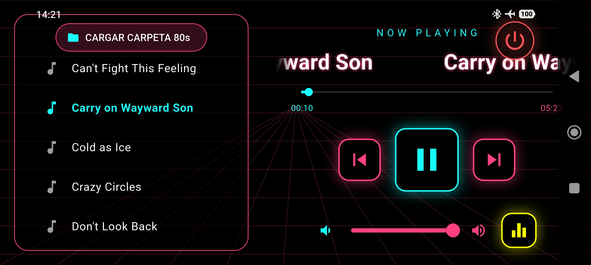
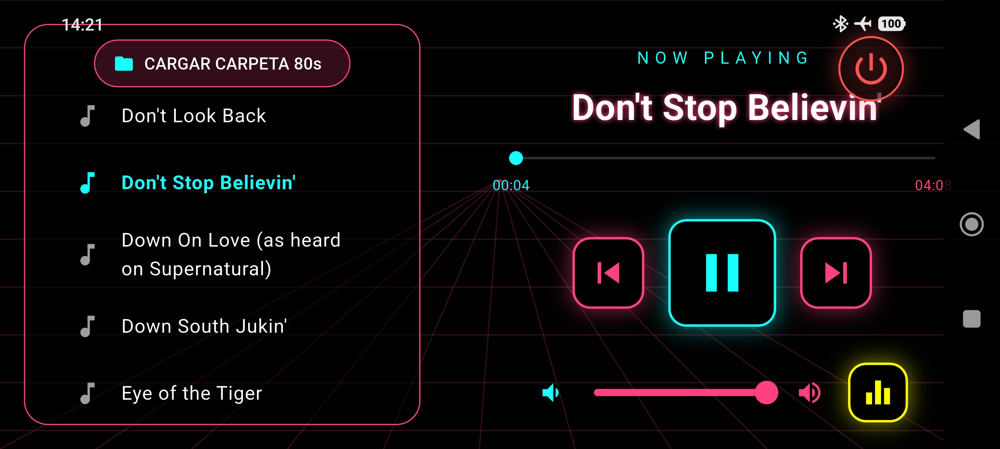

# 🕹️ Neon MP3 Player: El Salpicadero Digital del 1984 🕹️


> "Hay cien mil calles en esta ciudad. No necesitas saber el camino. Solo necesitas el tracklist adecuado." — *Un desarrollador anónimo con una chaqueta de escorpión.*

**Neon MP3 Player** no es un reproductor de música. Es una máquina del tiempo programada en **Flutter** para aquellos que conducen a través de una red de neón infinito. Si tu música no suena mientras una cuadrícula fucsia converge en el horizonte de tu pantalla, ¿realmente estás escuchando música?

<p align="center">
  
  <br>
  <i>"I Drive. My Music Drives. We all Drive."</i>
</p>
---

## 🔥 Características del Motor (Specs)

* **🛸 Levitación Antigravedad:** La interfaz del reproductor flota mediante oscilación senoidal matemática. Porque la gravedad es para los lenguajes que no tienen `AnimationController`.
* **🌌 Horizonte de Eventos 3D:** Un fondo `CustomPainter` que dibuja una rejilla retro-futurista. No garantizamos que no aparezca un Delorean en tu habitación al usarlo.
* **🎚️ Ecualizador de Hardware:** Conectado directamente a la "tubería" de efectos de Android. Si activas el modo **ROCK**, el `LoudnessEnhancer` le da un puñetazo de decibelios a tus oídos.
* **📜 Marquesina Infinita:** ¿Títulos de canciones de 50 caracteres? El widget `Marquee` se encarga de que leas cada letra mientras esquivas patrullas de policía pixeladas.
* **☕ Modo Vigilia (Wakelock):** La pantalla nunca se apaga. Tu batería sufrirá, pero tu estética será impecable.

---

## 🛠️ Cómo arrancar el bólido

1.  **Clona este sueño húmedo de laca y sintetizadores:**
    ```bash
    git clone [https://github.com/robertotejado/neon_drive_player.git](https://github.com/robertotejado/neon_drive_player.git)
    ```
2.  **Entra en el garaje:**
    ```bash
    cd neon_drive_player
    ```
3.  **Reposta combustible (Dependencias):**
    ```bash
    flutter pub get
    ```
4.  **Quema goma:**
    ```bash
    flutter run --release
    ```

---

## 🛠️ Stack Tecnológico (Under the Hood)

* **Motor:** [just_audio](https://pub.dev/packages/just_audio) - El motor de combustión interna para tus MP3.
* **Transmisión:** [file_picker](https://pub.dev/packages/file_picker) - Para elegir la ruta de tu viaje.
* **Chasis:** [Flutter SDK](https://flutter.dev) - Estructura de fibra de carbono y neón.
* **Óxido Nitroso:** [wakelock_plus](https://pub.dev/packages/wakelock_plus) - Para que la luz no se apague nunca.

---

## 🚦 Requisitos de Seguridad

* Tener música con muchos sintetizadores (obligatorio).
* Gafas de sol de aviador (opcional, pero recomendado).
* Permisos de almacenamiento en Android (para que la app no se quede en el parking).

---

## ⚖️ Licencia

Este proyecto está bajo la licencia **MIT**. Eres libre de usarlo, copiarlo y modificarlo, siempre y cuando mantengas el nivel de neón por encima del **90%**.

---

## 🤝 Contribuciones

¿Has encontrado un bug? ¿La rejilla no es lo suficientemente rosa? Abre un *Pull Request*. Si tu código tiene el flow de un solo de teclado de los 80, será aceptado de inmediato.

*Hecho con ❤️, ☕ y mucha estética Outrun.*


<p align="center">
  
  <br>
  <i>"I Drive. My Music Drives. We all Drive."</i>
</p>
